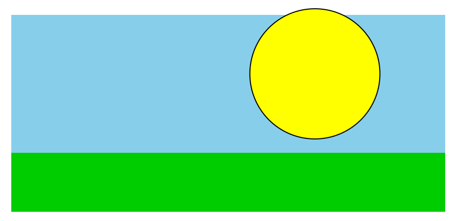

I am a research assistant professor at the University of New Mexico, a linguist & a data scientist. I like to talk #rstats, NLP, LLMs, and American Politics. GitHub | BlueSky | Linkedin

## Posts
2024-06-18: [A plot demonstration in r](2024-06-18-plot-demo.html)

2023-06-18: [some quick thoughts on gerrymandering](2023-06-18-thoughts-gerrymander.html)

2022-02-14: [sun, sky & grass](2022-02-14-sun-sky-grass.html)

Last updated: 2025-07-31 19:00:14
